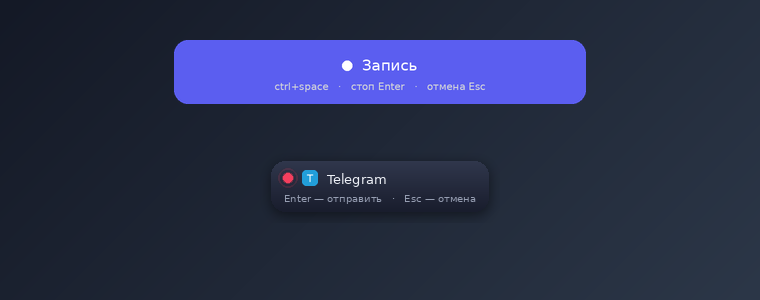

<p align="center">
  
</p>

<h1 align="center">SpokenGo</h1>

<p align="center">
  Voice input into <b>any</b> text field, anywhere on Windows.<br>
  Press your hotkey → speak → it transcribes (Groq Whisper) and pastes into the field you were in.
</p>

<p align="center">
  
  
  
  
</p>

---

## Features

- **Works in any field** — chat, browser, editor, address bars. No per-app setup.
- **Global hotkey** — start with `Ctrl+Space` (configurable by pressing a key combo), **stop with `Enter`**, **cancel with `Esc`**.
- **Live indicator** — a small floating pill shows it's recording and *which app* the text will land in.
- **Local & private** — audio + history stay on your machine; the API key lives in the Windows Credential Manager, never in a file.
- **Pluggable models** — ships with Groq Whisper; adding another provider is one class.
- **No runaway costs** — silence is skipped, one request per dictation, failed items aren't auto-retried.

<p align="center">
  
</p>

## Install (Windows)

You need [Python 3.10+](https://www.python.org/downloads/) (tick *Add to PATH* during install).

```powershell
git clone https://github.com/svyatrunov/SpokenGo.git
cd SpokenGo
powershell -ExecutionPolicy Bypass -File scripts\install.ps1
```

The installer sets everything up in an isolated `.venv` and puts a **SpokenGo icon on your Desktop and Start Menu** — launch it like a normal app. No terminal, no `.exe` to trust.

> Why no prebuilt `.exe`? Unsigned executables trip SmartScreen/antivirus and ask people to trust a binary. Installing from source into a venv is safer and fully transparent.

## Get a Groq API key

1. Open **https://console.groq.com/keys** and create a key (free tier available).
2. Paste it when the installer asks — or later in the app: **Settings → API key → Save**.

The key is stored in the Windows Credential Manager (service `SpokenGo`), not on disk.

## Usage

| Action | Key |
| --- | --- |
| Start recording | `Ctrl+Space` (or your own combo) |
| Stop & insert | `Enter` |
| Cancel | `Esc` |

Press the hotkey anywhere, speak, press `Enter`. The text is pasted into whatever field is focused. The window's **Record** button does the same.

## Privacy & security

- **API key**: stored in Windows Credential Manager via [`keyring`](https://pypi.org/project/keyring/) — not in config files or the repo.
- **Your data**: recordings and transcript history are stored locally under `%APPDATA%\SpokenGo` and can be auto-deleted (configurable). Audio storage can be turned off entirely.
- **Network**: the app talks to exactly one endpoint — `api.groq.com` — to transcribe. Nothing else.
- **No telemetry**, no analytics, no background calls. Failed transcriptions are retried only when you press *Retry*.
- The clipboard is restored to its previous contents after each paste.

See [docs/BUGS.md](docs/BUGS.md) for the full list of edge cases handled, and [docs/ARCHITECTURE.md](docs/ARCHITECTURE.md) for the design.

## Development

```bash
pip install -e ".[dev]"
pytest            # 86 tests, run on Linux/macOS/Windows without hardware
```

The platform layer (win32 injection, microphone, global hotkeys, the layered overlay) is isolated behind interfaces and mocked in tests, so the entire core — state machine, clipboard cycle, providers, queue, storage — is tested without Windows or a network. CI runs the suite on Python 3.10–3.12.

### Add a transcription provider

```python
from spokengo.transcribe.registry import register_provider
from spokengo.transcribe.base import Transcript

@register_provider("openai")
class OpenAIProvider:
    def __init__(self, api_key): ...
    def transcribe(self, audio_path, *, model, language=None) -> Transcript:
        ...
```

Then set `provider = "openai"` in the config and `spokengo set-key openai <KEY>`.

## CLI

```
spokengo            # open the window (default)
spokengo set-key groq <KEY>
spokengo logs -n 40 # view the log (for troubleshooting)
spokengo history
spokengo --version
```

## Contributing

Issues and PRs welcome — new providers, packaging for macOS/Linux, and UI polish especially. Please run `pytest` before opening a PR.

## License

[MIT](LICENSE).
