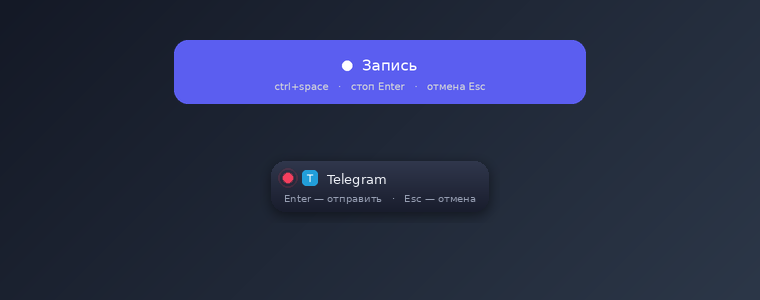

<p align="center">
  
</p>

<h1 align="center">SpokenGo</h1>

<p align="center">
  Voice input into <b>any</b> text field, anywhere on Windows.<br>
  Press your hotkey → speak → transcribed text is pasted where your cursor was.
</p>

<p align="center">
  
  
  
  
</p>

---

## Features

- **Works in any field** — chat, browser, editor, terminal, address bar. No per-app setup.
- **Global hotkey** — start with `Ctrl+Space` (configurable), **stop with `Enter`**, **cancel with `Esc`**.
- **Two transcription modes** — cloud via Groq Whisper API, or fully offline with a bundled-on-demand [whisper.cpp](https://github.com/ggml-org/whisper.cpp) engine. Switch in one click, no restart, no Python or pip — the app downloads the engine (~8 MB) and a model of your choice itself.
- **Live overlay** — a floating pill shows it's recording and *which app* text will land in.
- **Nothing is lost** — last transcript stays on the clipboard, History has one-click copy and per-item retry, failed items are queued for later.
- **Private by default** — audio and history stay on your machine; API key lives in Windows Credential Manager, never in a file.

<p align="center">
  
</p>

---

## Install (Windows)

### Option A — download and run (easiest)

1. Download **SpokenGo.exe** from the [latest release](https://github.com/svyatrunov/spokengo/releases/latest).
2. Double-click it. Windows shows *"Windows protected your PC"* — click **More info**, then **Run anyway**. The build is not code-signed, so that warning is expected.
3. On first launch it copies itself somewhere permanent and puts a **SpokenGo** icon on your Desktop. You can delete the download afterwards.

No Python, no terminal, no ZIP. Offline mode works from the .exe too — see
[Local mode](#local-mode-offline-no-api-key) below.

### Option B — install from source

Needs [Python 3.10+](https://www.python.org/downloads/) — tick **Add python.exe to PATH** during setup.

```powershell
git clone https://github.com/svyatrunov/spokengo.git
cd spokengo
powershell -ExecutionPolicy Bypass -File scripts\install.ps1
```

The installer creates an isolated `.venv`, installs SpokenGo and its dependencies,
asks for your Groq API key (optional — you can add it later), and puts a shortcut
on the Desktop and in the Start Menu.

Choose this one if you want to read the code you are running, hack on it, or
update with `git pull`.

---

## Groq API key (cloud mode)

1. Open [console.groq.com/keys](https://console.groq.com/keys) and create a key — free tier is generous.
2. Paste it in the app: **Settings → API key → Save**.

The key is stored in Windows Credential Manager (service `SpokenGo`), never on disk.

---

## Local mode (offline, no API key)

SpokenGo can transcribe entirely on your machine. No internet connection or API
key is needed once set up, and nothing leaves your computer.

Groq is the main, fast path. Offline mode is the fallback for when there is no
internet: open **Settings → Распознавание → Офлайн · запасной** and follow the
two steps in the window:

1. **Установить движок** — downloads the official
   [whisper.cpp](https://github.com/ggml-org/whisper.cpp) command-line build
   (`whisper-bin-x64.zip`, ~8 MB, SHA-256 verified) into
   `%LOCALAPPDATA%\SpokenGo\engine`. It runs on any x64 CPU — the right
   instruction set (SSE4.2 … AVX-512) is picked automatically at start.
2. **Скачать модель** — pick one from the list; it lands in
   `%LOCALAPPDATA%\SpokenGo\models` with a progress bar and is selected
   automatically.

| Model | Size | Speed | Accuracy | Notes |
|---|---|---|---|---|
| Tiny | 78 MB | ●●●●● | ●○○○○ | instant, weak for Russian |
| Base | 148 MB | ●●●●○ | ●●○○○ | fast, tolerable Russian |
| **Small** ★ | 488 MB | ●●●○○ | ●●●○○ | recommended: best speed/accuracy on a CPU |

Large models (`large-v3-turbo`, `large-v3-turbo-q5_0`) are no longer offered
for download: on an ordinary CPU a short phrase takes over a minute. If one is
already on disk, or you pick it with **Выбрать файл…**, it still works and is
labelled «медленно». For large-model accuracy use Groq.

Already have a model? SpokenGo also **finds models on its own**: its models
folder, `~/whisper.cpp/models`, `Downloads`, every HuggingFace cache location
(`HF_HOME`, `HUGGINGFACE_HUB_CACHE`, `~/.cache/huggingface`, `%USERPROFILE%`),
plus any folder you add with **Папку…**. **Выбрать файл…** accepts a
`ggml-*.bin` file, a faster-whisper snapshot folder, or a `whisper-cli.exe` you
built yourself.

<details>
<summary>faster-whisper (optional, source installs only)</summary>

If `faster-whisper` is importable in the environment SpokenGo runs from, its
CTranslate2 models (e.g. `Systran/faster-whisper-medium` from the HF cache) show
up in the same picker and run through that library instead. The one-file `.exe`
cannot import packages installed afterwards, which is why whisper.cpp is the
default engine for everyone.

```powershell
.venv\Scripts\pip install faster-whisper
.venv\Scripts\huggingface-cli download Systran/faster-whisper-medium
```
</details>

Headless / scripted setup:

```powershell
spokengo local                 # what is installed, what is selected, what is missing
spokengo local install         # fetch the engine
spokengo local models          # catalogue
spokengo local download small  # fetch a model and switch to local mode
```

> Runs on CPU. No GPU required. If your network blocks GitHub or Hugging Face,
> download the two files elsewhere and point SpokenGo at them with **Выбрать файл…**.

---

## Usage

| Action | Key |
|---|---|
| Start recording | `Ctrl+Space` (or your combo) |
| Stop & paste | `Enter` |
| Cancel | `Esc` |

Press the hotkey anywhere, speak, press `Enter`. Text is pasted into the focused field. The **Record** button in the window does the same thing.

### Start automatically at login

```powershell
powershell -ExecutionPolicy Bypass -File scripts\autostart.ps1
```

Undo with `scripts\autostart.ps1 -Remove`. A single-instance guard prevents double-launch.

---

## Privacy & security

| What | Where |
|---|---|
| API key | Windows Credential Manager — never in files or the repo |
| Audio recordings | `%APPDATA%\SpokenGo\` — local only, auto-deleted after N days (configurable) |
| Transcript history | `%APPDATA%\SpokenGo\` — local only |
| Network (cloud mode) | One endpoint only: `api.groq.com` |
| Network (local mode) | None while transcribing. Only the one-time downloads: `github.com` (engine) and `huggingface.co` (model) |

No telemetry. No analytics. No background calls. Failed transcriptions are retried only when you press **Retry**.

The last transcript stays on the clipboard so you can paste it again anywhere even if the first paste missed. Set `restore_clipboard = true` in the config to restore your previous clipboard instead.

---

## CLI

```
spokengo                         # open the control panel (default)
spokengo gui                     # same, explicit
spokengo run                     # headless mode (hotkey only, no window)
spokengo install                 # (re)create the Desktop shortcut
spokengo install --icon logo.png # use a custom icon (.ico / .png / .jpg)
spokengo install --start-menu    # also add to Start Menu
spokengo set-key groq <KEY>      # store a Groq API key
spokengo history                 # print recent transcripts
spokengo logs -n 50              # view log file (for troubleshooting)
spokengo local [install|download <id>|models]   # offline engine + models, no GUI
spokengo --version
```

---

## Development

```bash
pip install -e ".[dev]"
pytest            # 140 tests, run on any OS without hardware or network
```

The platform layer (win32 injection, microphone, global hotkeys, overlay window) is isolated behind interfaces and mocked in tests — the entire core (state machine, providers, queue, storage, clipboard cycle) is tested without Windows or a network connection.

### Add a transcription provider

```python
from spokengo.transcribe.registry import register_provider
from spokengo.transcribe.base import Transcript

@register_provider("openai")
class OpenAIProvider:
    name = "openai"
    def __init__(self, api_key): ...
    def transcribe(self, audio_path, *, model, language=None) -> Transcript: ...
```

Then set `provider = "openai"` in `config.toml` and `spokengo set-key openai <KEY>`.

---

## Contributing

Issues and PRs are welcome — new providers, macOS/Linux support, UI polish. Please run `pytest` before opening a PR.

See [docs/ARCHITECTURE.md](docs/ARCHITECTURE.md) for the design, [docs/BUGS.md](docs/BUGS.md) for edge cases handled.

## License

[MIT](LICENSE).
